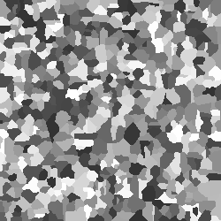

# Feuerverzinkung
41 Bundeswettbewerb Informatik

---
## Info:
- __Team-ID:__ *00080* 
- __Team:__ *If-Schleife*
- __Bearbeiter/-innen:__ *Richard Ewert*
- __Datum:__ *17. Oktober 2022*

---
## Lösungsidee
Die Simulation basiert auf "Wachstumsevents". 
Sie stellen dar wann und wohin ein Kristall wächst.
Die Simulation schreitet nur dann fort, wenn es durch ein Event ausgelöst wird,
um keine unnötigen Schritte zu berechnen.
Die Events haben einen Zeitpunkt, zu welchem sie eintreten.
Das jeweils frühste Event wird ausgeführt.
Es verändert den Zustand der Simulation und
erstellt die daraus folgenden weiteren Events.

---
## Umsetzung
Ein zweidimensionaler Numpy Array `crystal_image` der angegebenen größe wird mit Nullen gefüllt:
```crystal_image = np.zeros((size_y, size_x))```
Er repräsentiert den aktuellen Zustand der Simulation. Alle Felder sind Leer.

Eine verkettete Liste `events` enthält alle Events, welche noch auftreten.

Ein Event ist ein Objekt der Klasse `GrowthEvent`:
```
class GrowthEvent:
    def __init__(self, time_offsets: [], time: float, position: [], color: int) -> None:
        self.time_offsets: [] = time_offsets
        self.time: float = time
        self.position: [] = position
        self.color: int = color
```
Es enthält alle informationen die für ein Wachstum wichtig sind:
- `time_offsets` Ein Array mit 4 Werten, für jede Richtung einen, mit der jeweiligen Zeit zwischen den Wachstumschritten
- `time` Der Zeitpunkt zu dem das Event ausgeführt werden soll
- `position` die Position, welche vom Event verändert werden soll
- `color` die Farbe des Kristalls, welcher wächst

Die `events` Liste wird zu begin auf die von der `init_events()` Funktion erstellten Events initialisiert.
Diese Funktion erstellt eine bestimmte Anzahl an `GrowthEvents` mit zufälligen Werten und gibt sie als Liste zurück. 
Nur der `time` Wert wird auf 0 Initialisiert.

```events = init_events(amount=round(size_x*size_y/1000))```

Damit die Fortschrittsanzeige funktionieren kann benötigt sie eine feste Anzahl an Wiederholungen und einen eine
aktuelle Iteration. Deshalb wird der folgende Teil für jedes Pixel des zu erstellendes Bildes so oft wiederholt bis ein Pixel 
verändert wurde: Das unterste `GrowthEvent` in der `events` Liste wird der `fire()` Funktion übergeben und im selben Schritt
aus der Liste entfernt.

```
events = init_events(amount=round(size_x*size_y/1000))  # Seed-Kristalle werden initialsiert
    for i in tqdm(range(size_x * size_y)):                  # Für die Menge an Pixeln im Bild (nötig für Fortschrittsanzeige)
        old_simulated = simulated_pixels
        while simulated_pixels <= old_simulated:            # Solange es keine Veränderung im Bild gibt
            fire(events.pop(0))                             # Wird das unterste Event, also das mit der geringsten Zeit, ausgeführt und aus der Liste entfernt  
```

Die `fire()` Funktion prüft, ob an dieser Stelle nicht schon ein Kristall existiert.
Nur, wenn das nicht der Fall ist, wird an dieser Stelle ein Kristall der entsprechenden Farbe eingetragen,
die Menge an veränderten Pixeln `simulated_pixel` um 1 erhöht und alle aus diesem Event entstehenden Events der `events`
Liste hinzugefügt.
```
    if crystal_image[event.position[0]][event.position[1]] == 0:
        # Den Wert in der Matrix, an der richtigen Position, auf den Farbwert des Events setzen
        crystal_image[event.position[0]][event.position[1]] = event.color

        global simulated_pixels     # Globale Variable im Namespace bekannt machen
        simulated_pixels += 1       # Anzahl schon veränderter Pixel um 1 erhöhen

        # Eine Liste aller Positionen, an denen ein neues Event auftreten muss, erstellen
        positions = [
            [event.position[0] + 0, event.position[1] + 1],
            [event.position[0] + 0, event.position[1] + -1],
            [event.position[0] + 1, event.position[1] + 0],
            [event.position[0] + -1, event.position[1] + 0]
        ]
        for position, direction in zip(positions, range(4)):                # Jede dieser Positionen
            if size_y > position[0] >= 0 and size_x > position[1] >= 0:     # wird, falls sie innerhalb der Simulation liegen,
                if crystal_image[position[0]][position[1]] == 0:            # und noch nicht belegt sind
                    new_event = GrowthEvent(event.time_offsets, event.time + event.time_offsets[direction], position, event.color)
                    events.append(new_event)                                # als Teil eines neuen Events in die Event-Liste geschrieben
```
Die entstehenden Events werden bestimmt, indem zuerst eine Liste aller neu entstehenden Positionen erstellt wird.
Das sind eben die Position des aktuellen Events, plus ein entsprechendes offset für jede der 4 Richtungen.
Die Positionen werden nun darauf geprüft, ob sie innerhalb der Simulation sind und keine Stelle, die schon einen Kristall
besitzt, verändern. Wenn all das zutrifft, wird ein neues `GrowthEvent` mit demselben `time_offsets`, `position` und `color`
der `events` Liste hinzugefügt.
Nur der Eintrittszeitpunkt wird verändert. Der Eintrittszeitpunkt des neuen Events entspricht dem Eintrittszeitpunkt 
des aktuellen Events plus, dem der Richtung entsprechenden Eintrag in `time_offsets`.

Wenn alle neuen Events hinzugefügt wurden, wird die `events` Liste nach dem `time` Wert sortiert, 
damit immer das erst auftretende Event ausgeführt wird.

```
events.sort(key=lambda x: x.time)   # Die Event-Liste wird nach Zeit sortiert
```

---
## Beispiele
Unterschiedliche 250*250 Pixel große Bilder mit im Durchschnitt 1000 Pixel großen Kristallen:

:  
:  

Ein 500*500 Pixel großes Bild mit im Durchschnitt 100 Pixel großen Kristallen:
:  

Unterschiedliche 50*50 Pixel große Bilder mit im Durchschnitt 100 Pixel großen Kristallen:
:      
:      
:      
:      
:      

Ein 250*250 Pixel großes Bild mit im Durchschnitt 100 Pixel großen Kristallen:
:  

---
## Quellcode

```
def fire(event: GrowthEvent) -> None:
    """
    Führt ein Wachstumsevent durch, erstellt die daraus Folgenden und sortiert sie an die richtigen Stellen ein

    :param event: Das durchzuführende Wachstumsevent
    :return: Nichts
    """
    # Nur Falls die zu schreibende Position noch nicht belegt ist:
    if crystal_image[event.position[0]][event.position[1]] == 0:
        # Den Wert in der Matrix, an der richtigen Position, auf den Farbwert des Events setzen
        crystal_image[event.position[0]][event.position[1]] = event.color

        global simulated_pixels     # Globale Variable im Namespace bekannt machen
        simulated_pixels += 1       # Anzahl schon veränderter Pixel um 1 erhöhen

        # Eine Liste aller Positionen, an denen ein neues Event auftreten muss, erstellen
        positions = [
            [event.position[0] + 0, event.position[1] + 1],
            [event.position[0] + 0, event.position[1] + -1],
            [event.position[0] + 1, event.position[1] + 0],
            [event.position[0] + -1, event.position[1] + 0]
        ]
        for position, direction in zip(positions, range(4)):                # Jede dieser Positionen
            if size_y > position[0] >= 0 and size_x > position[1] >= 0:     # wird, falls sie innerhalb der Simulation liegen,
                if crystal_image[position[0]][position[1]] == 0:            # und noch nicht belegt sind
                    new_event = GrowthEvent(event.time_offsets, event.time + event.time_offsets[direction], position, event.color)
                    events.append(new_event)                                # als Teil eines neuen Events in die Event-Liste geschrieben
        events.sort(key=lambda x: x.time)   # Die Event-Liste wird nach Zeit sortiert
```

```
if __name__ == "__main__":
    events = init_events(amount=cristal_amount)  # Seed-Kristalle werden initialsiert
    for i in tqdm(range(size_x * size_y)):                  # Für die Menge an Pixeln im Bild (nötig für Fortschrittsanzeige)
        old_simulated = simulated_pixels
        while simulated_pixels <= old_simulated:            # Solange es keine Veränderung im Bild gibt
            fire(events.pop(0))                             # Wird das unterste Event, also das mit der geringsten Zeit, ausgeführt und aus der Liste entfernt

    render(crystal_image, f"x{size_x}y{size_y}a{cristal_amount}" + f"_{0}")
```